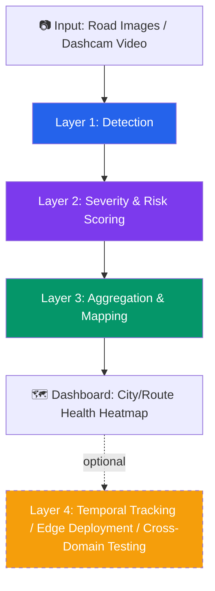

# 🛣️ TarmacLook

**AI-powered road damage detection, severity scoring, and health mapping — from a single image to a city-wide dashboard.**

<p align="center">
  
  
  
  
  
  
</p>

---

## 📍 What is TarmacLook?

Potholes and cracks don't just appear — they get worse until someone drives over them and reports it, usually too late. TarmacLook turns raw road imagery into a **living health record** for road infrastructure: it detects damage, scores how urgent it is, and plots it on a map so the worst roads are obvious at a glance — not buried in a spreadsheet.

Instead of stopping at "pothole detected," TarmacLook asks three follow-up questions no basic detector answers:
- **How bad is it, really?** → a single interpretable *Road Health Index (RHI)* per segment
- **Where is it worst?** → a map, not a list of coordinates
- **Is it getting worse?** → (stretch goal) damage progression over time

---

## 🧠 How it works — the four-layer pipeline



| Layer | What it does | Status |
|---|---|---|
| **1. Detection** | Fine-tuned YOLOv8 on RDD2022 — identifies longitudinal cracks, transverse cracks, alligator cracks, and potholes | 🚧 In progress *(SVM baseline done)* |
| **2. Severity & Risk Scoring** | Converts raw detections into a *Road Health Index* using bounding box area, damage density, and damage-type urgency weighting | ⏳ Planned |
| **3. Aggregation & Mapping** | Clusters detections by GPS/frame order into road segments, renders a Folium/Plotly heatmap of road health | ⏳ Planned |
| **4. Stretch goals** | Temporal damage tracking, edge deployment (ONNX/TensorRT on Raspberry Pi), cross-domain generalization across India/Japan/Czech/Norway | 💭 Exploring |

---

## 📊 Current Progress

```
[██████░░░░░░░░░░░░░░░░░░░░░░░░] ~20% complete
```

- ✅ Exploratory Data Analysis on RDD2022
- ✅ Baseline SVM classifier (establishes a performance floor to beat)
- 🚧 YOLOv8 fine-tuning on the four damage classes
- ⬜ Road Health Index scoring engine
- ⬜ Streamlit + Folium mapping dashboard
- ⬜ Stretch: temporal tracking / edge deployment / cross-domain testing

> **Why the SVM baseline matters:** it's not filler — it's the number every later model has to beat. Once YOLOv8 is trained, this README will show a direct baseline-vs-deep-learning comparison table.

---

## 🗺️ Roadmap

- [x] **Phase 0 — Foundations**: Dataset exploration, class distribution analysis, baseline SVM model
- [ ] **Phase 1 — Detection**: Fine-tune YOLOv8 (or RT-DETR) on RDD2022's 4 damage classes; evaluate mAP@0.5 per class
- [ ] **Phase 2 — Scoring**: Design and implement the Road Health Index formula (severity × density × urgency weighting)
- [ ] **Phase 3 — Mapping**: Build segment clustering + interactive Streamlit dashboard with a Folium heatmap
- [ ] **Phase 4 — Stretch** *(pick 1–2)*:
  - [ ] Temporal tracking — quantify damage growth across repeated passes
  - [ ] Edge deployment — ONNX/TensorRT export, live inference on Raspberry Pi
  - [ ] Cross-domain generalization — benchmark performance drop across India/Japan/Czech/Norway subsets

---

## 📁 Repository Structure

```
tarmac-look/
├── data/                  # dataset links + sample images (raw data not committed)
├── notebooks/             # EDA, baseline SVM, YOLOv8 training notebooks
├── src/
│   ├── detection/         # YOLOv8/RT-DETR training + inference
│   ├── severity/          # Road Health Index scoring logic
│   ├── aggregation/       # GPS clustering, segment mapping
│   └── dashboard/         # Streamlit + Folium/Plotly app
├── models/                # trained weights (hosted externally, linked here)
├── results/               # metrics tables, sample visualizations
└── docs/                  # architecture diagrams, writeups
```

---

## ⚙️ Setup

```bash
git clone https://github.com/<your-username>/tarmac-look.git
cd tarmac-look
pip install -r requirements.txt
```

Dataset: [RDD2022](https://github.com/sekilab/RoadDamageDetector) (not committed to this repo — see `data/README.md` for download instructions).

---

## 📈 Results *(updated as the project progresses)*

| Model | mAP@0.5 | Precision | Recall |
|---|---|---|---|
| Baseline SVM | *TBD* | *TBD* | *TBD* |
| YOLOv8 (fine-tuned) | *coming soon* | — | — |

---

## 🧩 Tech Stack

`Python` · `PyTorch` · `Ultralytics YOLOv8` · `OpenCV` · `scikit-learn` · `Streamlit` · `Folium` / `Plotly` · `ONNX` *(stretch)*

---

## 📜 License

This project is licensed under the MIT License — see [LICENSE](LICENSE) for details.

---

<p align="center"><i>Built as an active work-in-progress capstone project. Star ⭐ the repo to follow along as layers get added.</i></p>
