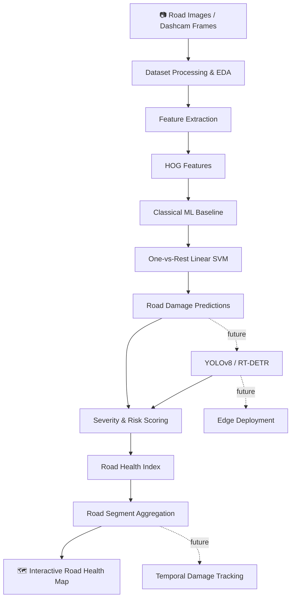

# 🛣️ TarmacLook

**AI-powered road damage detection, severity assessment, and infrastructure health mapping — from road imagery to actionable road-condition intelligence.**

<p align="center">
  
  
  
  
  
  
  
</p>

---

## 📍 Overview

**TarmacLook** is a computer-vision and machine-learning project focused on automated road-condition assessment.

The project aims to move beyond simply detecting a pothole or crack. The long-term objective is to transform road imagery into a structured representation of **what damage exists, how severe it is, where it occurs, and how road condition changes over time**.

The current implementation establishes the machine-learning foundation using the **Road Damage Dataset 2022 (RDD2022)** and a classical computer-vision baseline. Deep-learning-based object detection and road-health scoring are the next stages of development.

### Core questions TarmacLook aims to answer

* **What is wrong with the road?**
  Detect and classify visible road damage.

* **How significant is the damage?**
  Estimate severity using damage characteristics and spatial information.

* **Where is the damage concentrated?**
  Aggregate detections into road segments and visualize them geographically.

* **How is the road condition changing?**
  Track damage across repeated observations as a future extension.

---

## 🧠 System Architecture



---

## 🚧 Current Development Status

| Component                             | Status      |
| ------------------------------------- | ----------- |
| RDD2022 dataset acquisition & parsing | ✅ Completed |
| Exploratory data analysis             | ✅ Completed |
| Class distribution analysis           | ✅ Completed |
| HOG feature engineering               | ✅ Completed |
| Multilabel SVM baseline               | ✅ Completed |
| Validation & test evaluation          | ✅ Completed |
| Literature review                     | ✅ Completed |
| ANN experimentation                   | ✅ Completed |
| Deep-learning object detector         | 🚧 Next     |
| Road Health Index                     | ⬜ Planned   |
| Road-segment aggregation              | ⬜ Planned   |
| Interactive road-health dashboard     | ⬜ Planned   |
| Temporal damage tracking              | ⬜ Future    |
| Edge deployment                       | ⬜ Future    |
| Cross-domain evaluation               | ⬜ Future    |

---

# 📊 RDD2022 Dataset Analysis

TarmacLook currently uses the **Road Damage Dataset 2022 (RDD2022)**.

The dataset contains road images and annotations representing multiple types of road damage. The current preprocessing pipeline identifies **five damage categories**:

1. Longitudinal Crack
2. Transverse Crack
3. Alligator Crack
4. Other Corruption
5. Pothole

The dataset processing pipeline currently parses the YOLO-format annotations and constructs multilabel representations for each image.

### Dataset statistics from the current pipeline

| Split      |     Images |
| ---------- | ---------: |
| Training   |     26,869 |
| Validation |      5,758 |
| Test       |      5,758 |
| Total      | **38,385** |

The annotation analysis identified:

* **77,436 annotation records**
* **11,724 images with empty annotation files**
* **5 distinct damage classes**

Class distribution:

| Class              | Annotation Count |
| ------------------ | ---------------: |
| Longitudinal Crack |           26,016 |
| Transverse Crack   |           11,830 |
| Alligator Crack    |           10,617 |
| Other Corruption   |           10,705 |
| Pothole            |            6,544 |

For computationally feasible experimentation, the current baseline uses a reproducible subsample of:

* **8,000 training images**
* **2,000 validation images**
* **2,000 test images**

---

# 🔬 Classical Computer-Vision Baseline

Before introducing deep-learning object detectors, TarmacLook establishes a reproducible classical machine-learning baseline.

### Feature extraction

Each image is:

1. Converted to RGB
2. Resized
3. Converted to grayscale
4. Processed using **Histogram of Oriented Gradients (HOG)**

Current HOG configuration:

```text
Orientations:       9
Pixels per cell:    16 × 16
Cells per block:    2 × 2
Block normalization: L2-Hys
Feature dimension:  1764
```

### Model

The baseline uses:

```text
OneVsRestClassifier
        ↓
LinearSVC
        ↓
class_weight = balanced
max_iter = 5000
```

This formulation treats road-damage recognition as a **multilabel classification problem**, allowing an image to contain multiple damage categories.

---

# 📈 Baseline Results

The baseline has now been evaluated on both validation and held-out test data.

### Final test performance

| Damage Type        | Precision |   Recall |       F1 |
| ------------------ | --------: | -------: | -------: |
| Longitudinal Crack |      0.57 |     0.67 | **0.61** |
| Transverse Crack   |      0.35 |     0.61 | **0.45** |
| Alligator Crack    |      0.37 |     0.62 | **0.46** |
| Other Corruption   |      0.44 |     0.63 | **0.52** |
| Pothole            |      0.20 |     0.51 | **0.29** |
| **Macro Average**  |  **0.39** | **0.61** | **0.47** |

### Overall metrics

| Metric           | Test Score |
| ---------------- | ---------: |
| **Macro-F1**     | **0.4667** |
| **Micro-F1**     | **0.4954** |
| **Hamming Loss** | **0.2683** |

The SVM is intentionally treated as a **baseline rather than the final detection system**. Its purpose is to establish a measurable performance floor that future deep-learning approaches must improve upon.

The strongest baseline performance is currently observed for **Longitudinal Crack**, while **Pothole** remains the most difficult class, with an F1-score of 0.29.

---

# 🧪 ANN Experiments

The repository also contains an independent ANN experimentation notebook exploring neural-network design choices and training behaviour.

The experiment evaluates:

* Baseline ANN
* ReLU
* Sigmoid
* Tanh
* Leaky ReLU
* Early stopping
* Hyperparameter-tuned ANN

The experiments achieved up to **96.67% test accuracy** on the experimental classification task, with early stopping producing the lowest recorded test loss among the evaluated configurations.

> This ANN experiment is maintained as a supporting machine-learning study and is separate from the RDD2022 road-damage baseline.

---

# 📚 Literature Review

A dedicated literature review has now been completed and added to the repository as:

```text
TarmacLook_Literature_Review.xlsx
```

The review is being used to guide the transition from simple damage classification toward a more complete road-condition assessment system.

Particular areas of interest include:

* Automated pavement-condition assessment
* Road-damage detection
* Deep-learning-based object detection
* Severity estimation
* Pavement Condition Index (PCI)
* Multi-task learning
* Smartphone / dashcam-based road inspection
* 3D reconstruction and damage measurement
* Road-condition mapping
* Temporal infrastructure monitoring

The literature review will inform the design of the project's future **severity scoring and Road Health Index** components.

---

# 🗺️ Road Health Index

The next major system component is a **Road Health Index (RHI)** designed to convert individual damage detections into an interpretable road-segment condition score.

The planned formulation will consider factors such as:

```text
Damage Type
     +
Damage Severity
     +
Damage Density
     +
Spatial Concentration
     ↓
Road Health Index
```

Potential inputs include:

* Bounding-box area
* Number of detected defects
* Damage category
* Damage-type severity weighting
* Damage density within a road segment
* Spatial concentration of defects

The objective is to produce a score that can be aggregated across road segments rather than reporting isolated detections.

---

# 🗺️ Road-Level Mapping

After detection and scoring, TarmacLook will aggregate observations spatially.

```text
Image / Video Frame
        ↓
Damage Detection
        ↓
GPS / Frame Association
        ↓
Road Segment Clustering
        ↓
Severity Aggregation
        ↓
Road Health Index
        ↓
Interactive Map
```

The planned visualization layer will use tools such as:

* **Streamlit**
* **Folium**
* **Plotly**

The final interface is intended to provide a city/route-level view of road condition and highlight areas requiring inspection or maintenance.

---

# 🚀 Roadmap

### Phase 0 — Foundations ✅

* [x] RDD2022 acquisition
* [x] Dataset parsing
* [x] Exploratory data analysis
* [x] Class-distribution analysis
* [x] Annotation analysis
* [x] Literature review
* [x] Classical ML baseline

### Phase 1 — Detection 🚧

* [x] HOG feature extraction
* [x] Multilabel SVM baseline
* [x] Validation and test evaluation
* [ ] Fine-tune YOLOv8
* [ ] Evaluate object-detection metrics
* [ ] Compare deep learning against SVM baseline
* [ ] Investigate RT-DETR as an alternative detector

### Phase 2 — Severity Scoring ⬜

* [ ] Define damage severity levels
* [ ] Develop damage-type weighting
* [ ] Implement Road Health Index
* [ ] Validate scoring methodology against literature

### Phase 3 — Road Mapping ⬜

* [ ] Associate detections with GPS/frame information
* [ ] Cluster detections into road segments
* [ ] Aggregate damage severity
* [ ] Build interactive Streamlit dashboard
* [ ] Add Folium/Plotly road-health visualization

### Phase 4 — Advanced Capabilities ⬜

* [ ] Temporal damage tracking
* [ ] Repeated-pass comparison
* [ ] Cross-domain evaluation
* [ ] ONNX/TensorRT inference
* [ ] Edge deployment
* [ ] Real-time dashcam inference

---

# 📁 Repository Structure

```text
TarmacLook/
│
├── ANN PRACTICAL ON PROJECT.ipynb
│   └── ANN experiments and architecture comparison
│
├── RoadDamageDetection.ipynb
│   └── RDD2022 processing, EDA and ML baseline
│
├── TarmacLook_annotated.ipynb
│   └── Documented baseline-model workflow
│
├── TarmacLook_Literature_Review.xlsx
│   └── Literature review and research references
│
└── README.md
```

As the project moves into the deep-learning and deployment stages, the repository structure will be expanded to separate:

```text
data/
notebooks/
src/
    detection/
    severity/
    aggregation/
    dashboard/
models/
results/
docs/
```

---

# ⚙️ Getting Started

Clone the repository:

```bash
git clone https://github.com/GuptaPurab/TarmacLook.git
cd TarmacLook
```

The primary experiments are currently implemented as Jupyter/Google Colab notebooks.

### Recommended workflow

1. Open `RoadDamageDetection.ipynb`
2. Acquire the RDD2022 dataset
3. Run the dataset analysis
4. Generate HOG features
5. Train the One-vs-Rest SVM
6. Evaluate validation and test performance

For ANN experimentation, open:

```text
ANN PRACTICAL ON PROJECT.ipynb
```

---

# 🧰 Tech Stack

### Machine Learning

`Python` · `scikit-learn` · `SVM` · `One-vs-Rest` · `HOG`

### Deep Learning

`PyTorch` · `Ultralytics YOLO` · `TensorFlow/Keras`

### Computer Vision

`OpenCV` · `scikit-image` · `PIL`

### Data Analysis

`NumPy` · `Pandas` · `Matplotlib`

### Planned Application Layer

`Streamlit` · `Folium` · `Plotly`

### Planned Deployment

`ONNX` · `TensorRT` · `Raspberry Pi`

---

# 🎯 Project Objective

TarmacLook is being developed toward a complete **AI-assisted road infrastructure monitoring pipeline**:

```text
                    TarmacLook
                         │
              ┌──────────┴──────────┐
              │                     │
        Road Imagery          Research Base
              │                     │
              ↓                     ↓
       Damage Detection      Literature Review
              │
              ↓
       Severity Estimation
              │
              ↓
       Road Health Index
              │
              ↓
       Road Segmentation
              │
              ↓
       Geographic Mapping
              │
              ↓
       Infrastructure
       Decision Support
```

The current SVM baseline establishes the first quantitative benchmark. The next major milestone is replacing the image-level classical classifier with a **deep-learning object-detection pipeline capable of localizing individual road defects**.

---

# 📜 License

This project is licensed under the **MIT License**. See [`LICENSE`](LICENSE) for details.

---

<p align="center">
  <i>TarmacLook — building an intelligent, data-driven approach to road infrastructure monitoring.</i>
</p>
